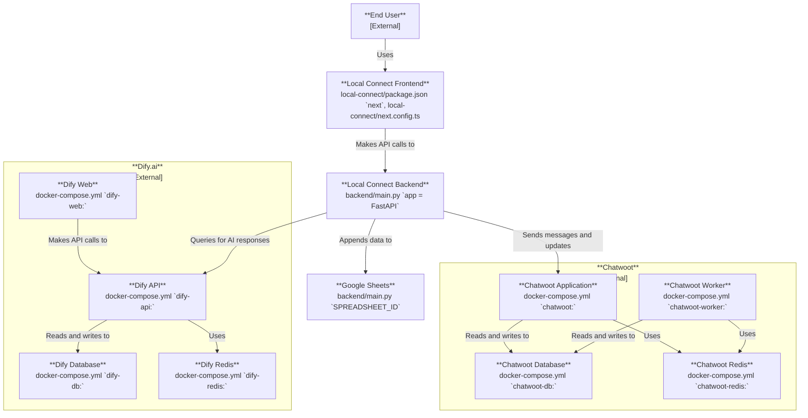

# Unnamed CodeViz Diagram

```mermaid
graph TD

    base.cv::local_connect_backend["**Local Connect Backend**<br>backend/main.py `app = FastAPI`"]
    base.cv::local_connect_frontend["**Local Connect Frontend**<br>local-connect/package.json `next`, local-connect/next.config.ts"]
    base.cv::end_user["**End User**<br>[External]"]
    base.cv::google_sheets["**Google Sheets**<br>backend/main.py `SPREADSHEET_ID`"]
    subgraph base.cv::dify_system["**Dify.ai**<br>[External]"]
        base.cv::dify_api["**Dify API**<br>docker-compose.yml `dify-api:`"]
        base.cv::dify_web["**Dify Web**<br>docker-compose.yml `dify-web:`"]
        base.cv::dify_db["**Dify Database**<br>docker-compose.yml `dify-db:`"]
        base.cv::dify_redis["**Dify Redis**<br>docker-compose.yml `dify-redis:`"]
        %% Edges at this level (grouped by source)
        base.cv::dify_api["**Dify API**<br>docker-compose.yml `dify-api:`"] -->|"Reads and writes to"| base.cv::dify_db["**Dify Database**<br>docker-compose.yml `dify-db:`"]
        base.cv::dify_api["**Dify API**<br>docker-compose.yml `dify-api:`"] -->|"Uses"| base.cv::dify_redis["**Dify Redis**<br>docker-compose.yml `dify-redis:`"]
        base.cv::dify_web["**Dify Web**<br>docker-compose.yml `dify-web:`"] -->|"Makes API calls to"| base.cv::dify_api["**Dify API**<br>docker-compose.yml `dify-api:`"]
    end
    subgraph base.cv::chatwoot_system["**Chatwoot**<br>[External]"]
        base.cv::chatwoot_app["**Chatwoot Application**<br>docker-compose.yml `chatwoot:`"]
        base.cv::chatwoot_worker["**Chatwoot Worker**<br>docker-compose.yml `chatwoot-worker:`"]
        base.cv::chatwoot_db["**Chatwoot Database**<br>docker-compose.yml `chatwoot-db:`"]
        base.cv::chatwoot_redis["**Chatwoot Redis**<br>docker-compose.yml `chatwoot-redis:`"]
        %% Edges at this level (grouped by source)
        base.cv::chatwoot_app["**Chatwoot Application**<br>docker-compose.yml `chatwoot:`"] -->|"Reads and writes to"| base.cv::chatwoot_db["**Chatwoot Database**<br>docker-compose.yml `chatwoot-db:`"]
        base.cv::chatwoot_app["**Chatwoot Application**<br>docker-compose.yml `chatwoot:`"] -->|"Uses"| base.cv::chatwoot_redis["**Chatwoot Redis**<br>docker-compose.yml `chatwoot-redis:`"]
        base.cv::chatwoot_worker["**Chatwoot Worker**<br>docker-compose.yml `chatwoot-worker:`"] -->|"Reads and writes to"| base.cv::chatwoot_db["**Chatwoot Database**<br>docker-compose.yml `chatwoot-db:`"]
        base.cv::chatwoot_worker["**Chatwoot Worker**<br>docker-compose.yml `chatwoot-worker:`"] -->|"Uses"| base.cv::chatwoot_redis["**Chatwoot Redis**<br>docker-compose.yml `chatwoot-redis:`"]
    end
    %% Edges at this level (grouped by source)
    base.cv::end_user["**End User**<br>[External]"] -->|"Uses"| base.cv::local_connect_frontend["**Local Connect Frontend**<br>local-connect/package.json `next`, local-connect/next.config.ts"]
    base.cv::local_connect_frontend["**Local Connect Frontend**<br>local-connect/package.json `next`, local-connect/next.config.ts"] -->|"Makes API calls to"| base.cv::local_connect_backend["**Local Connect Backend**<br>backend/main.py `app = FastAPI`"]
    base.cv::local_connect_backend["**Local Connect Backend**<br>backend/main.py `app = FastAPI`"] -->|"Queries for AI responses"| base.cv::dify_api["**Dify API**<br>docker-compose.yml `dify-api:`"]
    base.cv::local_connect_backend["**Local Connect Backend**<br>backend/main.py `app = FastAPI`"] -->|"Sends messages and updates"| base.cv::chatwoot_app["**Chatwoot Application**<br>docker-compose.yml `chatwoot:`"]
    base.cv::local_connect_backend["**Local Connect Backend**<br>backend/main.py `app = FastAPI`"] -->|"Appends data to"| base.cv::google_sheets["**Google Sheets**<br>backend/main.py `SPREADSHEET_ID`"]

```
---
*Generated by [CodeViz.ai](https://codeviz.ai) on 4/6/2026, 6:52:30 PM*
